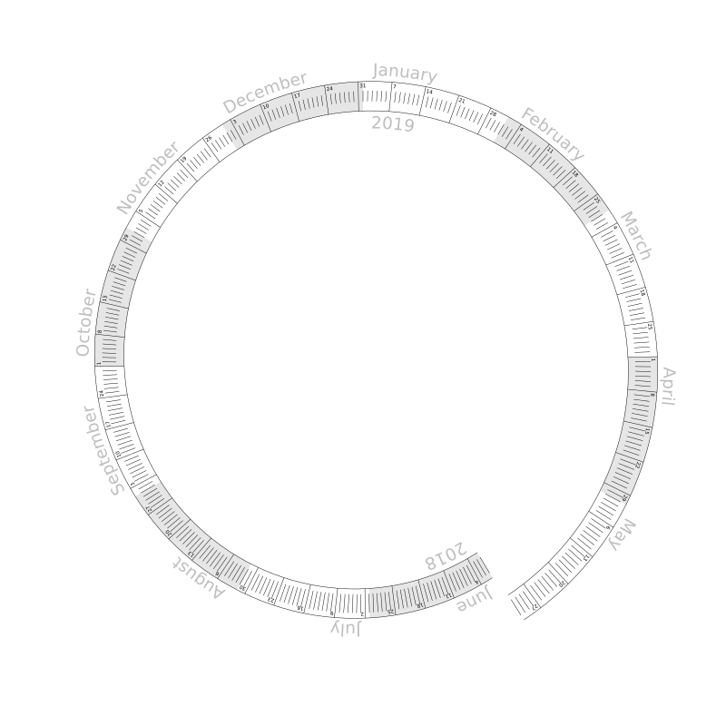

# Spiral Calendar

This is a Python program that generates a calendar that shows an entire year,
day by day, as a spiral. I created it when my daughters were young, so that they
could understand the answers to questions like, "When's my birthday?" or "When's
Christmas?" The linear presentation makes it easier to see relative distance and
ordering, and the spiral aspect emphasizes the cycle of the year.

I like to print these out, laminate them, and then let the kids write on them
with dry-erase markers.

## Running the script

This is written in Python 2. If you get syntax errors, you may be trying to run
it as Python 3. If you'd like to port it, post a pull request!

Running 'python gen_calendar.py' writes the calendar to 'calendar.svg' in
the current directory.

Parameters at the bottom of gen_calendar.py control the start and end date,
the mapping from dates to positions on the spiral, and everything else.

## Generating printable output

eog doesn't seem to be able to handle the label text set on curved paths. I
use Inkscape to render calendar.svg to a PDF file for printing:

    $ inkscape --file=calendar.svg --export-pdf=calendar.pdf --export-area-page
